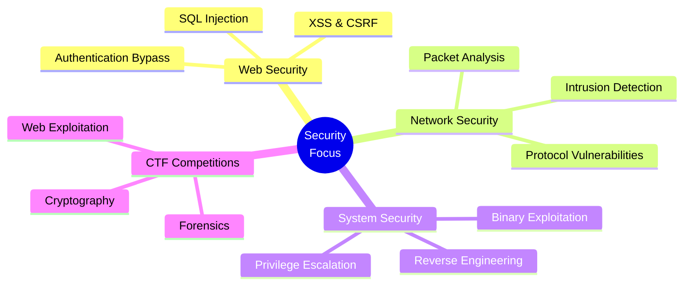

<div align="center">

# 🔐 ZHAMEER SHERAZ TAMPUGAO


[](https://github.com/zhameersheraz)
[](https://github.com/zhameersheraz)

</div>

---

<div align="center">
```ascii
╔═══════════════════════════════════════════════════════════════╗
║  👨‍💻 SECURITY RESEARCHER | 🛡️ PENETRATION TESTER | 🐛 BUG HUNTER  ║
╚═══════════════════════════════════════════════════════════════╝
```

</div>

## 🎯 ABOUT ME
```python
class SecurityResearcher:
    def __init__(self):
        self.name = "Zhameer Sheraz Tampugao"
        self.role = "Computer Student"
        self.location = "Philippines 🇵🇭"
        self.interests = [
            "Network Security",
            "Threat Analysis", 
            "Penetration Testing",
            "CTF Competitions",
            "Secure Coding"
        ]
    
    def current_focus(self):
        return [
            "Building secure systems and applications",
            "Exploring software vulnerabilities",
            "Threat analysis and mitigation",
            "CTF challenges and writeups"
        ]
    
    def get_certifications_goal(self):
        return ["CEH", "OSCP", "Security+", "eJPT"]
```

---

## 🛠️ TECH STACK

<div align="center">

### 💻 Languages


### 🔐 Security Tools


### 🗄️ Databases & Tools


</div>

---

## 📊 GITHUB STATISTICS

<div align="center">


</div>

---

## 🎓 FOCUS AREAS

<div align="center">


</div>

---

## 🚀 CURRENTLY LEARNING

<table align="center">
<tr>
<td align="center" width="50%">

### 🔍 Penetration Testing
- Advanced exploitation techniques
- Web application security testing
- Network penetration methodologies

</td>
<td align="center" width="50%">

### 🛡️ Defensive Security
- Incident response procedures
- Security monitoring & SIEM
- Threat hunting techniques

</td>
</tr>
<tr>
<td align="center" width="50%">

### 📝 CTF & Challenges
- Forensics analysis
- Cryptography challenges
- Reverse engineering

</td>
<td align="center" width="50%">

### 💻 Secure Development
- OWASP Top 10
- Secure coding practices
- API security testing

</td>
</tr>
</table>

---

## 🏆 ACHIEVEMENTS & PROJECTS

<div align="center">

[](https://github.com/zhameersheraz/CTF-Writeups)
[](#)

</div>

### 📂 Featured Repositories
```bash
┌──(zhameer㉿security)-[~/projects]
└─$ ls -la
drwxr-xr-x  CTF-Writeups/          # Detailed CTF challenge solutions
drwxr-xr-x  Security-Scripts/      # Automation & security tools
drwxr-xr-x  Vulnerability-Reports/ # Bug bounty findings
drwxr-xr-x  Network-Tools/         # Custom network analysis tools
```

---

## 🎯 2026 GOALS

- [x] Build comprehensive CTF writeup repository
- [ ] Earn eJPT certification
- [ ] Contribute to open-source security projects
- [ ] Participate in bug bounty programs
- [ ] Launch security blog/YouTube channel
- [ ] Complete OWASP Top 10 hands-on labs

---

## 📡 CONNECT WITH ME

<div align="center">

[](https://facebook.com/zhameersheraz)
[](#)
[](mailto:zhameersheraz@email.com)
[](#)

</div>

---

<div align="center">

### 💡 "Security is not a product, but a process."


</div>
